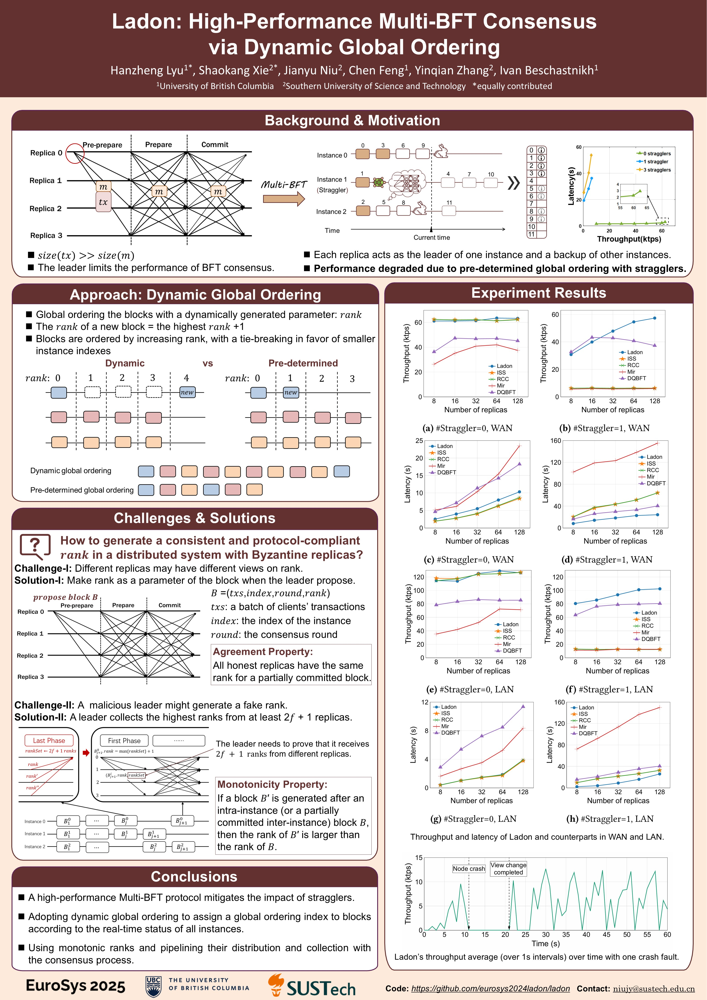

Short Bios
------
I am currently a PhD student at the University of British Columbia (UBC), under the supervision of [Chen Feng](https://engineering.ok.ubc.ca/about/contact/chen-feng/). I obtained my M.S. degree and B.E. degree from Beihang University (BUAA) in 2021 and 2018, respectively.

Publications
------
1. **Lyu H**, Xie S, Niu J, Feng C, Zhang Y, Beschastnikh I. Ladon: High-Performance and Secure Multi-BFT Consensus via Dynamic Global Ordering. The European Conference on Computer Systems (EuroSys). 2025. **[CCF A]**
2. **Lyu H**, Xie S, Niu J, Beschastnikh I, Zhang Y, Sadoghi M, Feng C. Orthrus: Accelerating Multi-BFT Consensus for Blockchains by Transaction Partial Ordering. IEEE International Conference on Data Engineering (ICDE). **[CCF A]**
3. **Lyu H**, Xie S, Niu J, Feng C. Byzantine Protocols with Asymptotically Optimal Communication Complexity. International Conference on Security and Privacy in Communication Networks (Securecomm). 2023. **[CCF C]**
4. **Lyu H**, Niu J, Gai F, Feng C. Publish or Perish: Defending Withholding Attack in Dfinity Consensus. IEEE International Conference on Mobility, Sensing and Networking (MSN), 2021. **[Best paper award，CCF C]**
5.	Guan Z, **Lyu H**, Li D, Hei Y, Wang T. Blockchain: A Distributed Solution to UAV-Enabled Mobile Edge Computing. IET Communications, 2020. 
6.	Guan Z, **Lyu H**, Zheng H, Li D. Distributed Audit System of SDN Controller Based on Blockchain. International Conference on Smart Blockchain (SmartBlock). 2019. 
7.	Wen X, Guan Z, Li D, **Lyu H**, Li H. A Blockchain-based Framework for Information Management in Internet of Vehicles. IEEE International Conference on Cyber Security and Cloud Computing (CSCloud)/ IEEE International Conference on Edge Computing and Scalable Cloud (EdgeCom), 2021.

In submission
------
1.	**Lyu H**, Gai F, Niu J, Luan H, Tong F, Feng C. CERBERUS: An Efficient and Lightweight Blockchain Protocol for Large-scale Industrial IoT. IEEE Internet of Things Journal (IoTJ). **[JCR Q1]**
2.	Zhou Y, Peng S, **Lyu H**, Tong F, Huang C, Niu J. Towards Consensus Enabled Collaborative Vehicles in Intelligent Transportation. IEEE Transactions on Vehicular Technology (TVT). **[JCR Q1]**
3.	Wen, X, Feng, Q, **Lyu, H**, Niu, J, Zhang, Y, Feng, C. TeeRollup: Efficient Rollup Design Using Heterogeneous TEE. IEEE Transactions on Computers (TC). **[CCF A]**

Posters
------

Last updated: 2025/4/17.
